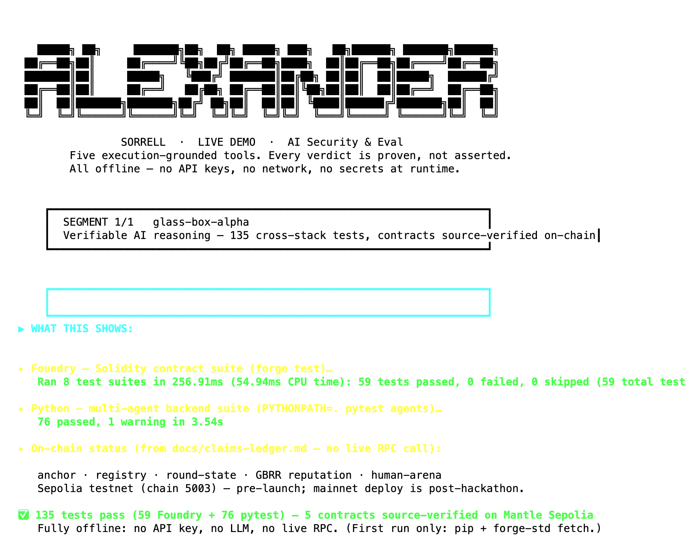
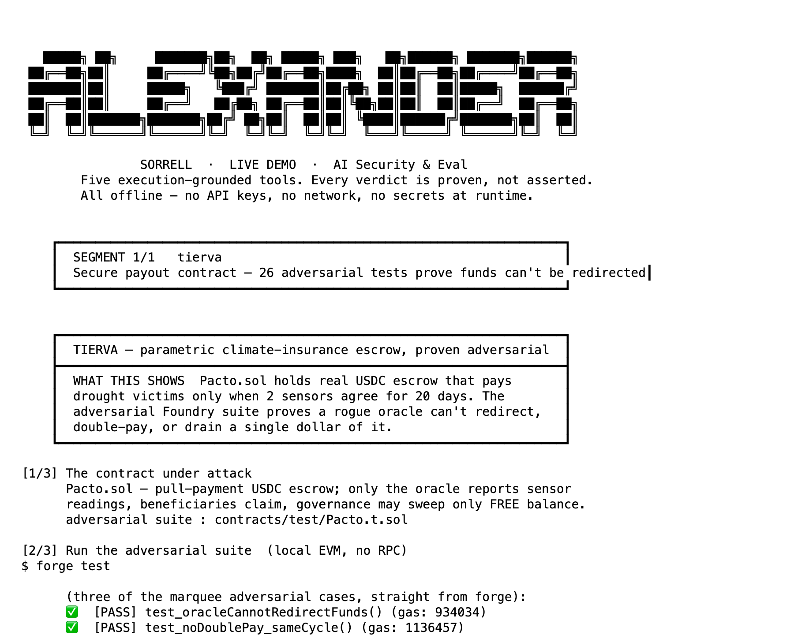

# AI Security & Eval — Live Demo

Reproducible demos of tools I built for AI-security, model-evaluation, and agent-reliability work. **Every verdict is proven by execution, not asserted** — there is no LLM in any verdict path. Run them yourself: no API keys, no network at runtime.

**Alexander Sorrell** · [github.com/Alexander-Sorrell-IT](https://github.com/Alexander-Sorrell-IT)

```bash
bash demo.sh                # full reel (pauses between tools)
bash demo.sh hexbreaker     # one tool
```
Each tool builds its own deps on first run (one-time, needs network once), then runs fully offline. The two smart-contract tools (glass-box-alpha, tierva) also need [Foundry](https://getfoundry.sh).

> **Honest framing up front:** these are hackathon / solo builds — working, tested code, not production systems run at scale. Results shown are committed and reproducible. Scope caveats are stated per tool below and on-screen in the demo.

---

## 1. hexbreaker — adversarial multi-LLM forensic evaluator


Five adversarial LLM roles (Prosecutor / Defender / Witness / Provocateur) argue a case; a **deterministic Python judge** decides. Every transcript is HMAC-signed and hash-chained, so any result is independently re-verifiable.

- **What it proves:** validated on the genuine **NIST CFReDS "Hacking Case"** disk image — recovered all 4 deleted recycle-bin executables, **F1 = 1.0 across 5 independently signed runs**. `hexbreaker verify` re-checks the whole chain live.
- **Honest scope:** this is NIST **Q28** (the recycle-bin question), ~1 of ~31 question families — *not* a full 31-question NIST F1. An earlier higher number was **withdrawn** after I found it leaked the answer key; a unit test now enforces the key never reaches the agent.
- **Source:** [github.com/Alexander-Sorrell-IT/hexbreaker](https://github.com/Alexander-Sorrell-IT/hexbreaker) · `bash run-hexbreaker.sh`

## 2. glass-box-alpha — verifiable AI reasoning, shipped on-chain



The thesis is "verifiable AI lets you check." The demo skips the network and goes straight to proof — running both test stacks green.

- **What it proves:** **135 tests pass across two independent stacks** (59 Foundry/Solidity + 76 Python), zero failures, confirmed by running them — not by reading the README. Five purpose-built contracts are **deployed and source-verified ("Exact Match")** on Mantle.
- **Honest scope:** Mantle **Sepolia testnet** (chain 5003), **pre-launch** — mainnet deploy is post-hackathon. The on-chain status is stated from the repo's own claims-ledger, not asserted beyond it.
- **Source:** [github.com/Alexander-Sorrell-IT/glass-box-alpha](https://github.com/Alexander-Sorrell-IT/glass-box-alpha) · `bash run-glass-box-alpha.sh`

## 3. tierva — secure payout contract with an adversarial test suite



The flip side of breaking systems: building one that holds. A parametric-payout USDC escrow (`Pacto.sol`) with a threat-modeled test suite run on a local EVM.

- **What it proves:** **26/26 adversarial Foundry tests pass**, proving on-chain that a rogue oracle **can't redirect funds**, **can't double-pay** within a cycle, and that governance can only sweep *free* escrow — never the USDC **reserved** for beneficiaries (`test_oracleCannotRedirectFunds`, `test_noDoublePay_sameCycle`, `test_withdrawOnlyFreeNotReserved`).
- **Source:** [github.com/Alexander-Sorrell-IT/tierva](https://github.com/Alexander-Sorrell-IT/tierva) · `bash run-tierva.sh`

## 4. robotruth — deterministic PR auditor (no LLM in the verdict path)


Reads what an AI agent **claimed** in a PR vs. what the diff **actually did**, and grades the divergence — cited at `file:line`.

- **What it proves:** on a fixture PR that claims "only tidies logging" but actually removes an auth guard, adds `eval()`, and adds a dependency, it returns **Grade: F — LIAR**. `grep` confirms zero `openai/anthropic/llm` in the verdict path; the grade is a pure deterministic function. 81 engine tests pass.
- **Source:** [github.com/Alexander-Sorrell-IT/robotruth](https://github.com/Alexander-Sorrell-IT/robotruth) · `bash run-robotruth.sh`

## 5. sentinel — pre-action interceptor for agents


Rules **ALLOW / BLOCK** on every tool call an AI agent attempts, *before* it executes, against a pydantic policy contract.

- **What it proves:** blocks a forbidden tool, a missing-human-approval call, and an out-of-scope wire transfer (all as critical/high), while letting the two legitimate calls through — **3/3 out-of-policy actions blocked.** ~47 tests pass.
- **Source:** [github.com/Alexander-Sorrell-IT/sentinel](https://github.com/Alexander-Sorrell-IT/sentinel) · `bash run-sentinel.sh`

---

## Also: codecrusher *(private — available on request)*
An adversarial smart-contract security pipeline (~9.3k LOC, 188 tests): static scanners feed an exploit synthesizer that auto-generates self-contained Foundry PoCs, confirming a finding only behind a real `forge [PASS]` — and rejecting a CEI-safe patched twin so it never rubber-stamps. Kept private; happy to demo it live.

## The thesis
The model proposes; **execution disposes.** A static flag is a hypothesis — a `forge [PASS]`, a signed transcript, or a deterministic grade is proof. That principle runs through every tool here.
